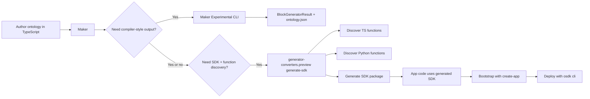

# OAC Stack Mental Model

## Short version

- `@osdk/maker` is the public authoring DSL.
- `@osdk/maker-experimental` is the newer V2/backend compiler path layered on top of Maker state.
- `@osdk/generator-converters` and `@osdk/generator-converters.ontologyir` are the metadata conversion layer.
- `@osdk/generator-converters.preview` is the first public package that ties IR conversion, function discovery, and SDK generation into one preview workflow.
- `@osdk/create-app` bootstraps local apps; `@osdk/cli` handles deployment and some operational workflows.
- The biggest public/private seam is TypeScript function discovery, which public Maker tries to load from private `@foundry/functions-typescript-osdk-discovery`.

## Dependency view

```mermaid
flowchart TD
    A[Ontology source code\n@osdk/maker DSL] --> B[Maker ontology state]
    B --> C[@osdk/maker-experimental\ndefineOntologyV2]
    B --> D[Ontology IR / metadata conversion]

    C --> E[OntologyIrV2 + shapes]
    E --> F[ontology.json + BlockGeneratorResult]

    D --> G[@osdk/generator-converters\n+ @osdk/generator-converters.ontologyir]
    G --> H[Full metadata]
    H --> I[@osdk/generator]
    I --> J[Generated TS SDK]

    A --> K[TS functions directory]
    L[Python functions directory] --> M[@osdk/generator-converters.preview]
    K --> M
    D --> M
    M --> N[Preview full metadata\nqueryTypes + fullLogicRules]
    N --> I
    M --> O[ontology-metadata.json]
    M --> P[Generated Python ontology SDK install step]

    Q[@osdk/create-app] --> R[React / Expo / Vue / tutorial templates]
    R --> J

    S[@osdk/cli] --> T[Site deploy/version flows]
    T --> U[@osdk/foundry.thirdpartyapplications APIs]

    V[Private package\n@foundry/functions-typescript-osdk-discovery] -.-> K
    A -. generateFunctionsIr .-> V
```

## Workflow view



## Package roles

### `@osdk/maker`

- Public frontend of ontology-as-code.
- Owns the authoring DSL and ontology state.
- Already contains a function-generation entrypoint, but that path is incomplete in public because discovery depends on a private package at runtime.

### `@osdk/maker-experimental`

- Public, but much more compiler/backend flavored.
- Calls `initializeOntologyState` and `getOntologyDefinition` from Maker, then converts that definition into V2 marketplace/block output.
- Emits `ontology.json` plus a `BlockGeneratorResult`, which looks like an internal platform packaging boundary rather than a dev-facing app artifact.

### `@osdk/generator-converters`

- Base conversion layer from ontology/query structures to OSDK metadata.
- Where newer query semantics keep landing first: branch awareness, transaction IDs, media IO.

### `@osdk/generator-converters.preview`

- The clearest public glimpse of the intended end-state pipeline.
- Accepts Ontology IR JSON, enriches it into preview full metadata, optionally discovers TypeScript and Python functions, then invokes `@osdk/generator` to emit an SDK.
- Also writes `ontology-metadata.json`, which suggests a richer sidecar artifact beyond just codegen output.

### `@osdk/create-app`

- Separate concern from the compiler stack.
- Uses embedded template bundles to scaffold app projects around an SDK-consuming workflow.
- Recent behavior suggests Palantir wants app bootstrapping to be flexible even before an SDK exists.

### `@osdk/cli`

- Separate operational CLI, not the compiler entrypoint.
- Most concrete public value today is site deployment/version management.
- Under the hood it drives `foundry.thirdpartyapplications`, so it is more of a deployment wrapper than a source compiler.

## Important seams

- `maker -> private TS discovery`: `generateFunctionsIr()` in public Maker lazily imports `@foundry/functions-typescript-osdk-discovery` and throws if it is unavailable.
- `preview converter -> public bridge`: `generator-converters.preview` is public, but it still relies on lower-level packages and likely mirrors internal workflows that are only partially externalized.
- `maker-experimental -> platform blocks`: its output shape looks closer to platform ingestion/build artifacts than to a polished public DX surface.

## Best current mental model

- Public OAC is real now, but still uneven.
- Maker is the stable public authoring face.
- Maker Experimental is the rewrite/backend path.
- Preview converters are the cross-language glue for discovery + SDK generation.
- App creation and deployment are increasingly public, but they sit downstream of the ontology/compiler stack, not inside it.
